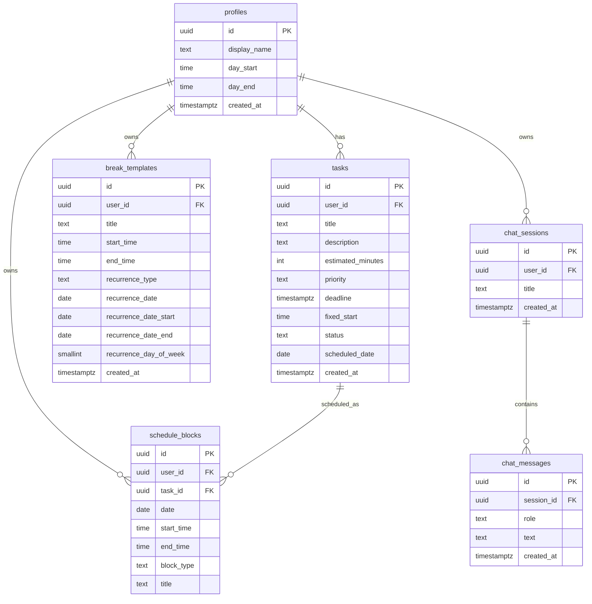

# SmartTime

**AI-powered daily planner.** Add your tasks, press "Build my day", and Gemini arranges them into a conflict-free, time-blocked schedule — rendered as a pixel-precise time grid.

---

## The Problem

Most people skip daily planning because it's slow and tedious: Google Calendar requires manual dragging, Todoist and TickTick show you a list but won't schedule it, and paid tools like Motion are expensive and opinionated. SmartTime removes the friction — one button, AI plans your day, deterministic code enforces the rules.

## Who Is It For

- **Knowledge workers and students** who need to turn a chaotic task list into an actionable day plan in under 10 seconds
- **Hebrew / Arabic speakers** — the app is RTL-first; layout, dates, and all text directions work out of the box
- Anyone who wants AI scheduling without a $19/mo subscription

## Differentiation vs Competitors

| Tool | Auto-schedules | Free / Open | RTL | Break management | Chat assistant |
|---|---|---|---|---|---|
| Google Calendar | No (manual) | Yes | Partial | No | No |
| Todoist / TickTick | No | Freemium | Yes | No | No |
| Motion | Yes (AI) | No ($19/mo) | No | Limited | No |
| **SmartTime** | **Yes (AI + deterministic)** | **Yes** | **Yes** | **Yes** | **Yes** |

---

## ERD

All six tables in Supabase PostgreSQL; every table is RLS-scoped to `auth.uid()`.  
Full schema with field-level detail: [`docs/ERD.md`](docs/ERD.md)



---

## External Services

| Service | Type | Purpose |
|---|---|---|
| Supabase | BaaS | PostgreSQL DB, Auth (Google OAuth), Edge Functions hosting |
| Google OAuth | Auth provider | User sign-in via Google account |
| Google Gemini 3.1 Flash Lite | AI API | Schedule generation & chat — called server-side only |
| Browser Notification API | Browser API | In-tab alerts for upcoming blocks (dual-threshold engine) |
| Vercel | Hosting | Frontend deployment |

**Security note:** The Gemini API key lives only as a Supabase Edge Function secret — it never reaches the browser or appears in any network response. You can verify this in DevTools → Network tab.

---

## Features

- **One-tap scheduling** — Gemini 3.1 Flash Lite turns your task list into a time-blocked day
- **Break templates** — define recurring or one-off breaks (daily, weekly, single date, date range) injected automatically into every generated schedule
- **Day / Week / Month views** — DateNav lets you navigate; breaks render in all views without rebuilding the schedule
- **Notification engine** — dual-threshold browser alerts (early warning + imminent) for upcoming blocks; per-notification dismiss in the NavBar bell
- **AI chat assistant** — persistent multi-session chat history, powered by Gemini 3.1 Flash Lite
- **RTL-first** — all CSS uses logical properties (`margin-inline-start`, `inset-inline-start`); never hardcoded `left`/`right`
- **Deterministic safety net** — if Gemini returns invalid JSON or violates constraints, a pure-JS fallback builds a valid schedule

---

## Architecture

```
Browser (Vite + React 19 + TS, RTL-first)
│
├── AuthContext            — session + profile, loaded once at app root
├── NotificationContext   — dual-threshold engine; bell icon in NavBar
├── /login                — Google OAuth via Supabase Auth
├── /dashboard            — TimeGrid (day/week/month) + "Build my day" + upcoming panel
│       └── DateNav        — navigate dates; MonthView / WeekView / TimeGrid per view
├── /tasks                — CRUD task list with inline validation
├── /profile              — day window, display name, break template management
└── /chat                 — AI assistant (Gemini) with persistent chat history
         │
         └── supabase.functions.invoke('generate-schedule')
                 │
                 └── Edge Function (Deno)
                         ├── Verify JWT
                         ├── Fetch pending tasks + profile + break templates
                         ├── Call Gemini 3.1 Flash Lite (structured JSON output)
                         ├── Deterministic repair pass (repairBlocks)
                         │    — enforces fixed_start pins, day bounds, no overlaps
                         │    — injects break templates
                         │    — falls back to buildDeterministicSchedule if AI fails
                         └── Delete today's blocks → insert new → return
```

---

## Running Locally

```bash
git clone <repo-url>
cd smarttime
npm install
cp .env.example .env
# Fill in:
#   VITE_SUPABASE_URL=https://<project>.supabase.co
#   VITE_SUPABASE_ANON_KEY=<anon-key>
npm run dev
```

Open [http://localhost:5173](http://localhost:5173).

### Demo flow

1. Sign in with a Google account
2. Go to **Tasks** → add 3–5 tasks with different priorities and estimated durations
3. Return to **Dashboard** → press **"בנה את היום שלי ✨"**
4. The schedule appears as a time grid — blocks are coloured by priority
5. Optional: go to **Profile** → add a break template (e.g. "Lunch" daily 13:00–14:00) and rebuild

> There is no pre-seeded demo account. Use any Google account — data is isolated per user by RLS.

---

## Required Setup

1. **Supabase project** — create at supabase.com, run all migrations in `supabase/migrations/` in chronological order
2. **Google OAuth** — enable in Supabase Auth → Providers → Google; add `http://localhost:5173` and your production URL to authorized origins and redirect URIs
3. **Gemini API key** — set as an Edge Function secret: `supabase secrets set GEMINI_API_KEY=<key>`
4. **Deploy Edge Function** — `supabase functions deploy generate-schedule`

## Commands

```bash
npm run dev        # Vite dev server at http://localhost:5173
npm run build      # tsc -b && vite build
npm run lint       # oxlint
npm run preview    # preview production build
supabase functions deploy generate-schedule   # redeploy edge function after changes
```
