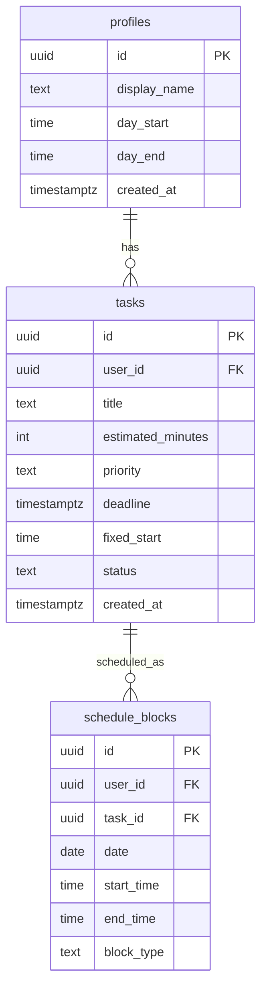

# SmartTime

AI-powered daily planner. Add tasks, press "Build my day", and the app arranges them into a conflict-free time-blocked schedule rendered as a pixel-precise time-grid.

## The Problem

Planning your day is cognitive overhead most people skip. Google Calendar requires manual dragging; Todoist/TickTick list tasks but don't schedule them; Motion auto-schedules but is expensive and opinionated. SmartTime is one-tap AI scheduling with deterministic safety guarantees — the AI plans, the code enforces.

## Differentiation vs Competitors

| Tool | Schedules for you | Free/Open | RTL support |
|---|---|---|---|
| Google Calendar | No (manual) | Yes | Partial |
| Todoist / TickTick | No | Freemium | Yes |
| Motion | Yes (AI) | No ($19/mo) | No |
| **SmartTime** | **Yes (AI + deterministic)** | **Yes** | **Yes** |

## External Services

| Service | Type | Purpose |
|---|---|---|
| Supabase | BaaS | PostgreSQL DB, Auth, Edge Functions hosting |
| Google OAuth | Auth provider | User sign-in via Google account |
| Google Gemini 2.5 Flash | AI API | Schedule generation — called server-side only |
| Browser Notification API | Browser API | In-tab alerts for upcoming blocks |
| Vercel | Hosting | Frontend deployment |

## ERD



## Architecture

```
Browser (Vite + React TS, RTL)
│
├── AuthContext  — session + profile, app-wide
├── /login       — Google OAuth
├── /dashboard   — time-grid + "Build my day" + upcoming panel
├── /tasks       — CRUD with inline validation
└── /profile     — day window + display name
         │
         └── supabase.functions.invoke('generate-schedule')
                 │
                 └── Edge Function (Deno)
                         ├── Verify JWT
                         ├── Fetch pending tasks + profile
                         ├── Call Gemini 2.5 Flash
                         ├── Deterministic repair pass
                         └── Upsert schedule_blocks → return
```

**Security:** The Gemini API key lives only as a Supabase Edge Function secret — it never reaches the browser or appears in network responses. RLS is enabled on all tables; every query is automatically scoped to `auth.uid()`.

## Running Locally

```bash
git clone <repo-url>
cd smarttime
npm install
cp .env.example .env
# Fill in VITE_SUPABASE_URL and VITE_SUPABASE_ANON_KEY from your Supabase project
npm run dev
```

Open [http://localhost:5173](http://localhost:5173).

> **Demo:** sign in with a Google account, add 3–5 tasks with different priorities, press "בנה את היום שלי ✨".

## Required Setup

1. **Supabase project** — create at supabase.com, run the migration in `supabase/migrations/`
2. **Google OAuth** — enable in Supabase Auth → Providers → Google; add `http://localhost:5173` and your production URL to authorized origins and redirect URIs
3. **Gemini API key** — set as an Edge Function secret: `supabase secrets set GEMINI_API_KEY=<key>`
4. **Deploy Edge Function** — `supabase functions deploy generate-schedule`
