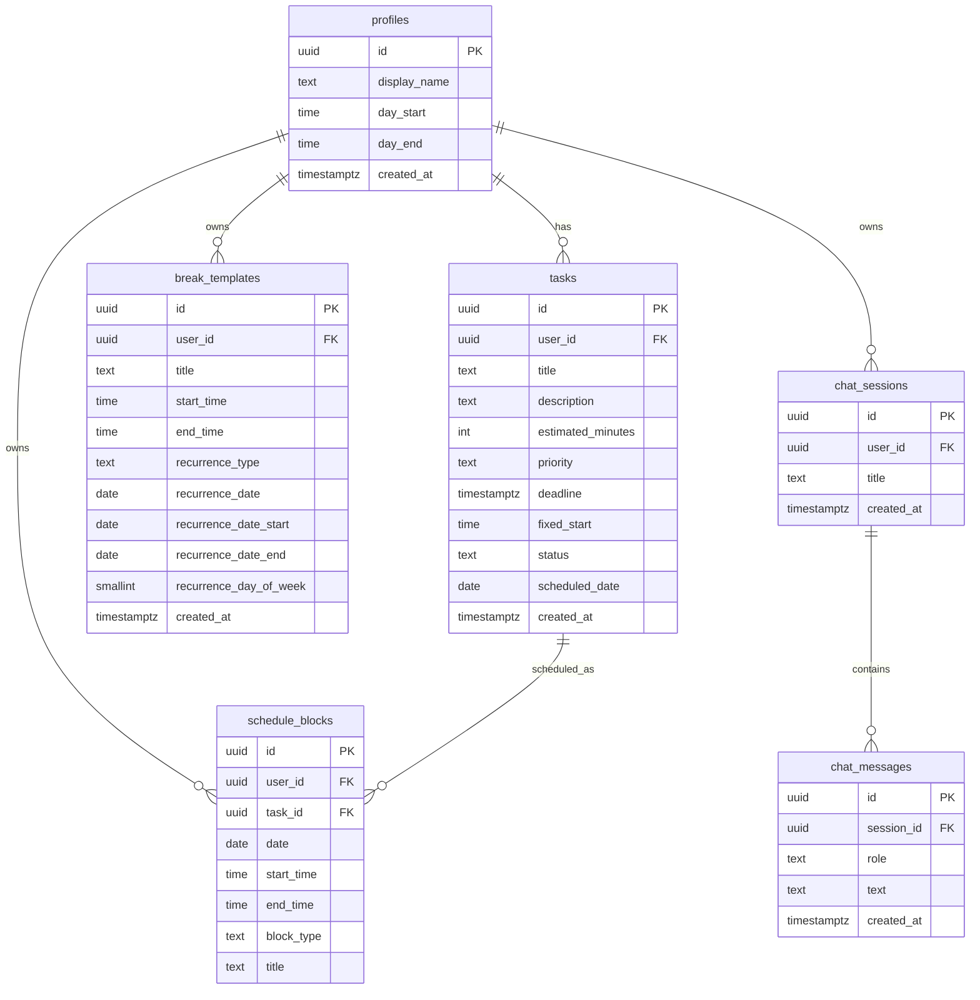

# SmartTime — Entity Relationship Diagram

All six tables live in Supabase PostgreSQL. Every table has RLS enabled; all queries are automatically scoped to `auth.uid() = user_id`.

## Table descriptions

| Table | Purpose |
|---|---|
| `profiles` | User display name and day window (start / end time) |
| `tasks` | Tasks with priority, estimated duration, optional deadline and fixed-start pin |
| `schedule_blocks` | AI-generated or break time blocks, one row per block per date |
| `break_templates` | Recurring or one-off break rules injected into every generated schedule |
| `chat_sessions` | AI assistant conversation containers |
| `chat_messages` | Individual user / model messages inside a chat session |

## Key constraints

- `tasks.priority` — `low | medium | high`
- `tasks.status` — `pending | done`
- `schedule_blocks.block_type` — `task | break`
- `chat_messages.role` — `user | model`
- `break_templates.recurrence_type` — `date | date_range | daily | weekly`
- All times stored as `HH:MM:SS`; all dates as `YYYY-MM-DD`
