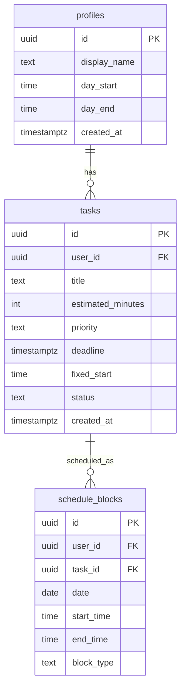

# SmartTime Implementation Plan

> **For agentic workers:** REQUIRED SUB-SKILL: Use superpowers:subagent-driven-development (recommended) or superpowers:executing-plans to implement this plan task-by-task. Steps use checkbox (`- [ ]`) syntax for tracking.

**Goal:** Build SmartTime — an AI daily planner where users add tasks, press "Build my day", and an Edge Function arranges them into a conflict-free time-blocked schedule rendered as a pixel-precise time-grid.

**Architecture:** AuthContext provides session + profile app-wide. Each page manages its own data via typed query helpers in `src/lib/queries/`. The Edge Function (Deno) calls Gemini 2.5 Flash, applies a deterministic repair pass, persists schedule_blocks, and returns them directly.

**Tech Stack:** Vite + React 19 TS, `@supabase/supabase-js` v2, React Router v7, vanilla CSS, Supabase Edge Functions (Deno), Google Gemini 2.5 Flash REST API.

## Global Constraints

- RTL layout: `direction: rtl` is set on `html` in `App.css` — all new UI must work correctly RTL
- Hebrew copy for all user-facing text
- No `window.alert`, `window.confirm`, or `window.prompt` — use inline UI patterns instead
- No new npm dependencies unless absolutely required
- All Supabase reads/writes go through helpers in `src/lib/queries/` — no raw Supabase calls in components
- Gemini API key lives only in the Edge Function as `Deno.env.get('GEMINI_API_KEY')` — never in client code
- Every branch must pass `npm run build` (tsc + vite) before merging
- Commit frequently with descriptive messages
- Supabase project ref: `eczwnfajqwuxqoumsyhj`

---

## Execution Waves

```
Wave 1 (parallel): Task A + Task B + Task C
Wave 2 (parallel, after Wave 1 merged): Task D + Task E
Wave 3 (after Wave 2 merged): Task F
Wave 4 (after Wave 3): Task G
```

---

## Task A: AuthContext + App wiring

**Branch:** `feat/auth-context`

**Files:**
- Create: `src/lib/types.ts`
- Create: `src/context/AuthContext.tsx`
- Modify: `src/App.tsx`
- Modify: `src/components/ProtectedRoute.tsx`
- Modify: `src/components/NavBar.tsx`

**Interfaces:**
- Produces: `useAuth()` hook → `{ session, userId, profile, setProfile }`
- Produces: `Profile`, `Task`, `ScheduleBlock` types from `src/lib/types.ts`
- Consumed by: Tasks B, D, E, F

---

- [ ] **Step 1: Create shared types**

Create `src/lib/types.ts`:

```typescript
export type Profile = {
  id: string
  display_name: string | null
  day_start: string  // "HH:MM:SS" from Postgres
  day_end: string    // "HH:MM:SS"
  created_at: string
}

export type Task = {
  id: string
  user_id: string
  title: string
  estimated_minutes: number
  priority: 'low' | 'medium' | 'high'
  deadline: string | null
  fixed_start: string | null  // "HH:MM:SS"
  status: 'pending' | 'done'
  created_at: string
}

export type ScheduleBlock = {
  id: string
  user_id: string
  task_id: string | null
  date: string        // "YYYY-MM-DD"
  start_time: string  // "HH:MM:SS"
  end_time: string    // "HH:MM:SS"
  block_type: 'task' | 'break'
}
```

- [ ] **Step 2: Create AuthContext**

Create `src/context/AuthContext.tsx`:

```typescript
import { createContext, useContext, useEffect, useState, type ReactNode } from 'react'
import { supabase } from '../lib/supabase'
import type { Session } from '@supabase/supabase-js'
import type { Profile } from '../lib/types'

type AuthContextValue = {
  session: Session | null | undefined   // undefined = still loading
  userId: string | null
  profile: Profile | null | undefined   // undefined = still loading
  setProfile: (p: Profile) => void
}

const AuthContext = createContext<AuthContextValue | null>(null)

export function AuthProvider({ children }: { children: ReactNode }) {
  const [session, setSession] = useState<Session | null | undefined>(undefined)
  const [profile, setProfile] = useState<Profile | null | undefined>(undefined)

  useEffect(() => {
    supabase.auth.getSession().then(({ data }) => setSession(data.session))
    const { data: listener } = supabase.auth.onAuthStateChange((_e, s) => {
      setSession(s)
      if (!s) setProfile(null)
    })
    return () => listener.subscription.unsubscribe()
  }, [])

  useEffect(() => {
    if (session === undefined) return
    if (!session) { setProfile(null); return }
    supabase
      .from('profiles')
      .select('*')
      .eq('id', session.user.id)
      .single()
      .then(({ data }) => setProfile((data as Profile) ?? null))
  }, [session])

  return (
    <AuthContext.Provider value={{
      session,
      userId: session?.user.id ?? null,
      profile,
      setProfile,
    }}>
      {children}
    </AuthContext.Provider>
  )
}

export function useAuth() {
  const ctx = useContext(AuthContext)
  if (!ctx) throw new Error('useAuth must be used inside AuthProvider')
  return ctx
}
```

- [ ] **Step 3: Update App.tsx to wrap with AuthProvider**

Replace the contents of `src/App.tsx`:

```typescript
import { BrowserRouter, Routes, Route, Navigate } from 'react-router-dom'
import { AuthProvider } from './context/AuthContext'
import Login from './pages/Login'
import Dashboard from './pages/Dashboard'
import Tasks from './pages/Tasks'
import Profile from './pages/Profile'
import ProtectedRoute from './components/ProtectedRoute'
import NavBar from './components/NavBar'
import './App.css'

function AppLayout({ children }: { children: React.ReactNode }) {
  return (
    <>
      <NavBar />
      <main className="main-content">{children}</main>
    </>
  )
}

export default function App() {
  return (
    <AuthProvider>
      <BrowserRouter>
        <Routes>
          <Route path="/login" element={<Login />} />
          <Route
            path="/dashboard"
            element={<ProtectedRoute><AppLayout><Dashboard /></AppLayout></ProtectedRoute>}
          />
          <Route
            path="/tasks"
            element={<ProtectedRoute><AppLayout><Tasks /></AppLayout></ProtectedRoute>}
          />
          <Route
            path="/profile"
            element={<ProtectedRoute><AppLayout><Profile /></AppLayout></ProtectedRoute>}
          />
          <Route path="*" element={<Navigate to="/dashboard" replace />} />
        </Routes>
      </BrowserRouter>
    </AuthProvider>
  )
}
```

- [ ] **Step 4: Update ProtectedRoute to use useAuth**

Replace `src/components/ProtectedRoute.tsx`:

```typescript
import { Navigate } from 'react-router-dom'
import { useAuth } from '../context/AuthContext'

export default function ProtectedRoute({ children }: { children: React.ReactNode }) {
  const { session, profile } = useAuth()

  // Still resolving session, or session exists but profile not yet fetched
  if (session === undefined || (session && profile === undefined)) {
    return <div className="loading">טוען...</div>
  }
  if (!session) return <Navigate to="/login" replace />
  return <>{children}</>
}
```

- [ ] **Step 5: Update NavBar to use useAuth**

Replace `src/components/NavBar.tsx`:

```typescript
import { Link } from 'react-router-dom'
import { supabase } from '../lib/supabase'
import { useAuth } from '../context/AuthContext'

export default function NavBar() {
  const { profile } = useAuth()
  const handleSignOut = () => supabase.auth.signOut()

  return (
    <nav className="navbar">
      <span className="navbar-brand">SmartTime</span>
      <div className="navbar-links">
        <Link to="/dashboard">לוח זמנים</Link>
        <Link to="/tasks">משימות</Link>
        <Link to="/profile">פרופיל</Link>
        {profile?.display_name && (
          <span className="navbar-user">{profile.display_name}</span>
        )}
        <button onClick={handleSignOut} className="btn-link">יציאה</button>
      </div>
    </nav>
  )
}
```

Add to `src/App.css` (append):

```css
.navbar-user {
  font-size: 0.85rem;
  color: var(--text-muted);
}
```

- [ ] **Step 6: Verify build**

```bash
npm run build
```

Expected: exits 0, no TypeScript errors.

- [ ] **Step 7: Commit**

```bash
git add src/lib/types.ts src/context/AuthContext.tsx src/App.tsx src/components/ProtectedRoute.tsx src/components/NavBar.tsx src/App.css
git commit -m "feat: add AuthContext, shared types, wire auth app-wide"
```

---

## Task B: Query helpers

**Branch:** `feat/query-helpers`

**Files:**
- Create: `src/lib/queries/tasks.ts`
- Create: `src/lib/queries/profile.ts`
- Create: `src/lib/queries/schedule.ts`

**Interfaces:**
- Consumes: `Profile`, `Task`, `ScheduleBlock` from `src/lib/types.ts` (Task A)
- Produces: all data-access functions used by Tasks D, E, F

---

- [ ] **Step 1: Create task queries**

Create `src/lib/queries/tasks.ts`:

```typescript
import { supabase } from '../supabase'
import type { Task } from '../types'

export async function fetchTasks(userId: string): Promise<Task[]> {
  const { data, error } = await supabase
    .from('tasks')
    .select('*')
    .eq('user_id', userId)
    .order('created_at', { ascending: false })
  if (error) throw error
  return data as Task[]
}

export async function createTask(
  userId: string,
  input: {
    title: string
    estimated_minutes: number
    priority: 'low' | 'medium' | 'high'
    deadline?: string | null
    fixed_start?: string | null
  }
): Promise<Task> {
  const { data, error } = await supabase
    .from('tasks')
    .insert({ ...input, user_id: userId })
    .select()
    .single()
  if (error) throw error
  return data as Task
}

export async function updateTask(
  id: string,
  input: {
    title?: string
    estimated_minutes?: number
    priority?: 'low' | 'medium' | 'high'
    deadline?: string | null
    fixed_start?: string | null
  }
): Promise<Task> {
  const { data, error } = await supabase
    .from('tasks')
    .update(input)
    .eq('id', id)
    .select()
    .single()
  if (error) throw error
  return data as Task
}

export async function deleteTask(id: string): Promise<void> {
  const { error } = await supabase.from('tasks').delete().eq('id', id)
  if (error) throw error
}

export async function markTaskDone(id: string): Promise<void> {
  const { error } = await supabase
    .from('tasks')
    .update({ status: 'done' })
    .eq('id', id)
  if (error) throw error
}
```

- [ ] **Step 2: Create profile queries**

Create `src/lib/queries/profile.ts`:

```typescript
import { supabase } from '../supabase'
import type { Profile } from '../types'

export async function updateProfile(
  id: string,
  input: {
    display_name?: string
    day_start?: string
    day_end?: string
  }
): Promise<Profile> {
  const { data, error } = await supabase
    .from('profiles')
    .update(input)
    .eq('id', id)
    .select()
    .single()
  if (error) throw error
  return data as Profile
}
```

- [ ] **Step 3: Create schedule queries**

Create `src/lib/queries/schedule.ts`:

```typescript
import { supabase } from '../supabase'
import type { ScheduleBlock } from '../types'

export async function fetchTodayBlocks(userId: string): Promise<ScheduleBlock[]> {
  const today = new Date().toISOString().split('T')[0]
  const { data, error } = await supabase
    .from('schedule_blocks')
    .select('*')
    .eq('user_id', userId)
    .eq('date', today)
    .order('start_time', { ascending: true })
  if (error) throw error
  return data as ScheduleBlock[]
}

export async function generateSchedule(): Promise<ScheduleBlock[]> {
  const { data, error } = await supabase.functions.invoke('generate-schedule')
  if (error) throw error
  return (data as { blocks: ScheduleBlock[] }).blocks
}
```

- [ ] **Step 4: Verify build**

```bash
npm run build
```

Expected: exits 0.

- [ ] **Step 5: Commit**

```bash
git add src/lib/queries/
git commit -m "feat: add typed query helpers for tasks, profile, schedule"
```

---

## Task C: Edge Function — generate-schedule

**Branch:** `feat/edge-function`

**Files:**
- Create: `supabase/functions/generate-schedule/index.ts`

**Interfaces:**
- Consumes: JWT from Authorization header, Supabase service role key, `GEMINI_API_KEY` env secret
- Produces: `{ blocks: ScheduleBlock[] }` JSON response

**Note:** This task can be written and committed without the Gemini key. Deployment (`supabase functions deploy`) requires Checkpoint C (Gemini key set as secret).

---

- [ ] **Step 1: Create the Edge Function**

Create `supabase/functions/generate-schedule/index.ts`:

```typescript
import { createClient } from 'https://esm.sh/@supabase/supabase-js@2'

const corsHeaders = {
  'Access-Control-Allow-Origin': '*',
  'Access-Control-Allow-Headers': 'authorization, x-client-info, apikey, content-type',
}

Deno.serve(async (req) => {
  if (req.method === 'OPTIONS') {
    return new Response('ok', { headers: corsHeaders })
  }

  try {
    const authHeader = req.headers.get('Authorization')
    if (!authHeader) {
      return new Response('Unauthorized', { status: 401, headers: corsHeaders })
    }

    const supabase = createClient(
      Deno.env.get('SUPABASE_URL')!,
      Deno.env.get('SUPABASE_SERVICE_ROLE_KEY')!,
    )

    const { data: { user }, error: authError } = await supabase.auth.getUser(
      authHeader.replace('Bearer ', '')
    )
    if (authError || !user) {
      return new Response('Unauthorized', { status: 401, headers: corsHeaders })
    }

    const userId = user.id
    const today = new Date().toISOString().split('T')[0]

    const [{ data: tasks, error: tasksError }, { data: profile, error: profileError }] =
      await Promise.all([
        supabase.from('tasks').select('*').eq('user_id', userId).eq('status', 'pending'),
        supabase.from('profiles').select('*').eq('id', userId).single(),
      ])

    if (tasksError) throw tasksError
    if (profileError) throw profileError

    const dayStart = profile.day_start.slice(0, 5)
    const dayEnd = profile.day_end.slice(0, 5)

    if (!tasks || tasks.length === 0) {
      await supabase.from('schedule_blocks').delete().eq('user_id', userId).eq('date', today)
      return new Response(JSON.stringify({ blocks: [] }), {
        headers: { ...corsHeaders, 'Content-Type': 'application/json' },
      })
    }

    const taskList = tasks.map((t: Record<string, unknown>) => ({
      id: t.id,
      title: t.title,
      estimated_minutes: t.estimated_minutes,
      priority: t.priority,
      deadline: t.deadline,
      fixed_start: t.fixed_start ? (t.fixed_start as string).slice(0, 5) : null,
    }))

    const prompt = `You are a schedule optimizer. Arrange these tasks into a time-blocked day.

Day window: ${dayStart}–${dayEnd}
Tasks: ${JSON.stringify(taskList)}

Rules:
- Place high-priority and deadline-bound tasks earlier in the day
- Tasks with fixed_start MUST start at exactly that time (block_type "task")
- Add 10-minute breaks (block_type "break", task_id null, title "הפסקה") after tasks of 60+ minutes
- Every block must fit within ${dayStart}–${dayEnd}
- Return ONLY a JSON object with a "blocks" array`

    const geminiKey = Deno.env.get('GEMINI_API_KEY')!
    const geminiUrl =
      `https://generativelanguage.googleapis.com/v1beta/models/gemini-2.5-flash:generateContent?key=${geminiKey}`

    const responseSchema = {
      type: 'object',
      properties: {
        blocks: {
          type: 'array',
          items: {
            type: 'object',
            properties: {
              task_id: { type: 'string', nullable: true },
              title: { type: 'string' },
              start_time: { type: 'string' },
              end_time: { type: 'string' },
              block_type: { type: 'string', enum: ['task', 'break'] },
            },
            required: ['task_id', 'title', 'start_time', 'end_time', 'block_type'],
          },
        },
      },
      required: ['blocks'],
    }

    let aiBlocks: AiBlock[] | null = null

    for (let attempt = 0; attempt < 2; attempt++) {
      const attemptPrompt = attempt === 1
        ? prompt + '\n\nIMPORTANT: Output raw JSON only — no markdown, no code fences.'
        : prompt

      try {
        const res = await fetch(geminiUrl, {
          method: 'POST',
          headers: { 'Content-Type': 'application/json' },
          body: JSON.stringify({
            contents: [{ parts: [{ text: attemptPrompt }] }],
            generationConfig: { responseMimeType: 'application/json', responseSchema },
          }),
        })

        if (res.ok) {
          const json = await res.json()
          const text = json?.candidates?.[0]?.content?.parts?.[0]?.text ?? ''
          const parsed = JSON.parse(text)
          if (Array.isArray(parsed?.blocks)) {
            aiBlocks = parsed.blocks
            break
          }
        }
      } catch {
        // retry
      }
    }

    if (!aiBlocks) {
      aiBlocks = buildDeterministicSchedule(tasks, dayStart, dayEnd)
    }

    const repairedBlocks = repairBlocks(aiBlocks, tasks, dayStart, dayEnd)

    await supabase.from('schedule_blocks').delete().eq('user_id', userId).eq('date', today)

    const toInsert = repairedBlocks.map((b) => ({
      user_id: userId,
      task_id: b.task_id ?? null,
      date: today,
      start_time: b.start_time,
      end_time: b.end_time,
      block_type: b.block_type,
    }))

    const { data: inserted, error: insertError } = await supabase
      .from('schedule_blocks')
      .insert(toInsert)
      .select()

    if (insertError) throw insertError

    return new Response(JSON.stringify({ blocks: inserted }), {
      headers: { ...corsHeaders, 'Content-Type': 'application/json' },
    })
  } catch (err) {
    console.error(err)
    return new Response(JSON.stringify({ error: String(err) }), {
      status: 500,
      headers: { ...corsHeaders, 'Content-Type': 'application/json' },
    })
  }
})

type AiBlock = {
  task_id: string | null
  title: string
  start_time: string  // "HH:MM"
  end_time: string    // "HH:MM"
  block_type: 'task' | 'break'
}

function timeToMinutes(t: string): number {
  const parts = t.split(':')
  return parseInt(parts[0]) * 60 + parseInt(parts[1])
}

function minutesToTime(m: number): string {
  const h = Math.floor(m / 60)
  const min = m % 60
  return `${String(h).padStart(2, '0')}:${String(min).padStart(2, '0')}`
}

function repairBlocks(
  aiBlocks: AiBlock[],
  tasks: Record<string, unknown>[],
  dayStart: string,
  dayEnd: string,
): AiBlock[] {
  const dayStartMin = timeToMinutes(dayStart)
  const dayEndMin = timeToMinutes(dayEnd)
  const taskMap = new Map(tasks.map((t) => [t.id as string, t]))

  // Pin fixed_start tasks
  const fixedPinned: AiBlock[] = tasks
    .filter((t) => t.fixed_start)
    .map((t) => ({
      task_id: t.id as string,
      title: t.title as string,
      start_time: (t.fixed_start as string).slice(0, 5),
      end_time: minutesToTime(
        timeToMinutes((t.fixed_start as string).slice(0, 5)) + (t.estimated_minutes as number)
      ),
      block_type: 'task' as const,
    }))

  // Filter AI blocks: remove fixed_start duplicates + out-of-window blocks
  const nonFixed = aiBlocks.filter((b) => {
    if (b.task_id && taskMap.get(b.task_id)?.fixed_start) return false
    const s = timeToMinutes(b.start_time)
    const e = timeToMinutes(b.end_time)
    return s >= dayStartMin && e <= dayEndMin && s < e
  })

  // Sort combined
  const all = [...fixedPinned, ...nonFixed].sort(
    (a, b) => timeToMinutes(a.start_time) - timeToMinutes(b.start_time)
  )

  // Greedy re-pack
  const packed: AiBlock[] = []
  let cursor = dayStartMin
  for (const block of all) {
    const s = Math.max(timeToMinutes(block.start_time), cursor)
    const duration = timeToMinutes(block.end_time) - timeToMinutes(block.start_time)
    const e = s + duration
    if (e > dayEndMin) continue
    packed.push({ ...block, start_time: minutesToTime(s), end_time: minutesToTime(e) })
    cursor = e
  }

  // Ensure every pending task appears exactly once
  const placedIds = new Set(packed.filter((b) => b.task_id).map((b) => b.task_id))
  for (const task of tasks) {
    if (placedIds.has(task.id as string)) continue
    const e = cursor + (task.estimated_minutes as number)
    if (e <= dayEndMin) {
      packed.push({
        task_id: task.id as string,
        title: task.title as string,
        start_time: minutesToTime(cursor),
        end_time: minutesToTime(e),
        block_type: 'task',
      })
      cursor = e
    }
  }

  return packed
}

function buildDeterministicSchedule(
  tasks: Record<string, unknown>[],
  dayStart: string,
  dayEnd: string,
): AiBlock[] {
  const dayEndMin = timeToMinutes(dayEnd)
  const order: Record<string, number> = { high: 0, medium: 1, low: 2 }

  const sorted = [...tasks].sort((a, b) => {
    const pa = order[a.priority as string] ?? 1
    const pb = order[b.priority as string] ?? 1
    if (pa !== pb) return pa - pb
    if (a.deadline && b.deadline) return (a.deadline as string).localeCompare(b.deadline as string)
    if (a.deadline) return -1
    if (b.deadline) return 1
    return 0
  })

  const blocks: AiBlock[] = []
  let cursor = timeToMinutes(dayStart)

  for (const task of sorted) {
    const start = task.fixed_start
      ? timeToMinutes((task.fixed_start as string).slice(0, 5))
      : cursor
    const end = start + (task.estimated_minutes as number)
    if (end > dayEndMin) continue
    blocks.push({
      task_id: task.id as string,
      title: task.title as string,
      start_time: minutesToTime(start),
      end_time: minutesToTime(end),
      block_type: 'task',
    })
    cursor = end
  }

  return blocks
}
```

- [ ] **Step 2: Commit**

```bash
git add supabase/functions/generate-schedule/index.ts
git commit -m "feat: add generate-schedule Edge Function with Gemini + deterministic repair"
```

---

## Task D: Tasks page — CRUD

**Branch:** `feat/tasks-page`
**Depends on:** Task A (AuthContext, types) + Task B (query helpers) merged to main

**Files:**
- Create: `src/components/TaskForm.tsx`
- Create: `src/components/TaskList.tsx`
- Modify: `src/pages/Tasks.tsx`
- Modify: `src/App.css` (append task styles)

**Interfaces:**
- Consumes: `useAuth()` → `userId`; `fetchTasks`, `createTask`, `updateTask`, `deleteTask` from queries
- Produces: full Tasks page

---

- [ ] **Step 1: Create TaskForm component**

Create `src/components/TaskForm.tsx`:

```typescript
import { useState, useEffect } from 'react'
import type { Task } from '../lib/types'

type FormData = {
  title: string
  estimated_minutes: string
  priority: 'low' | 'medium' | 'high'
  deadline: string
  fixed_start: string
}

type Props = {
  editTarget: Task | null
  onSubmit: (data: {
    title: string
    estimated_minutes: number
    priority: 'low' | 'medium' | 'high'
    deadline: string | null
    fixed_start: string | null
  }) => Promise<void>
  onCancel: () => void
  loading: boolean
}

const EMPTY: FormData = {
  title: '',
  estimated_minutes: '30',
  priority: 'medium',
  deadline: '',
  fixed_start: '',
}

export default function TaskForm({ editTarget, onSubmit, onCancel, loading }: Props) {
  const [form, setForm] = useState<FormData>(EMPTY)
  const [errors, setErrors] = useState<Partial<FormData>>({})

  useEffect(() => {
    if (editTarget) {
      setForm({
        title: editTarget.title,
        estimated_minutes: String(editTarget.estimated_minutes),
        priority: editTarget.priority as 'low' | 'medium' | 'high',
        deadline: editTarget.deadline ? editTarget.deadline.slice(0, 16) : '',
        fixed_start: editTarget.fixed_start ? editTarget.fixed_start.slice(0, 5) : '',
      })
    } else {
      setForm(EMPTY)
    }
    setErrors({})
  }, [editTarget])

  function validate(): boolean {
    const errs: Partial<FormData> = {}
    if (!form.title.trim()) errs.title = 'נדרש שם משימה'
    const mins = parseInt(form.estimated_minutes)
    if (!form.estimated_minutes || isNaN(mins) || mins <= 0) {
      errs.estimated_minutes = 'נדרשת משך זמן חיובי'
    }
    setErrors(errs)
    return Object.keys(errs).length === 0
  }

  async function handleSubmit(e: React.FormEvent) {
    e.preventDefault()
    if (!validate()) return
    await onSubmit({
      title: form.title.trim(),
      estimated_minutes: parseInt(form.estimated_minutes),
      priority: form.priority,
      deadline: form.deadline || null,
      fixed_start: form.fixed_start || null,
    })
    setForm(EMPTY)
    setErrors({})
  }

  function field(
    key: keyof FormData,
    label: string,
    input: React.ReactNode
  ) {
    return (
      <div className="form-field">
        <label className="form-label">{label}</label>
        {input}
        {errors[key] && <span className="form-error">{errors[key]}</span>}
      </div>
    )
  }

  return (
    <form onSubmit={handleSubmit} className="task-form">
      <h3>{editTarget ? 'עריכת משימה' : 'משימה חדשה'}</h3>

      {field('title', 'שם המשימה *',
        <input
          className="form-input"
          value={form.title}
          onChange={e => setForm(f => ({ ...f, title: e.target.value }))}
          placeholder="לדוגמה: לכתוב דו״ח שבועי"
        />
      )}

      {field('estimated_minutes', 'משך (דקות) *',
        <input
          className="form-input"
          type="number"
          min={1}
          value={form.estimated_minutes}
          onChange={e => setForm(f => ({ ...f, estimated_minutes: e.target.value }))}
        />
      )}

      {field('priority', 'עדיפות',
        <select
          className="form-input"
          value={form.priority}
          onChange={e => setForm(f => ({ ...f, priority: e.target.value as 'low' | 'medium' | 'high' }))}
        >
          <option value="high">גבוהה</option>
          <option value="medium">בינונית</option>
          <option value="low">נמוכה</option>
        </select>
      )}

      {field('deadline', 'דדליין (אופציונלי)',
        <input
          className="form-input"
          type="datetime-local"
          value={form.deadline}
          onChange={e => setForm(f => ({ ...f, deadline: e.target.value }))}
        />
      )}

      {field('fixed_start', 'שעת התחלה קבועה (אופציונלי)',
        <input
          className="form-input"
          type="time"
          value={form.fixed_start}
          onChange={e => setForm(f => ({ ...f, fixed_start: e.target.value }))}
        />
      )}

      <div className="form-actions">
        <button type="submit" className="btn-primary" disabled={loading}>
          {loading ? 'שומר...' : editTarget ? 'עדכן' : 'הוסף משימה'}
        </button>
        {editTarget && (
          <button type="button" className="btn-secondary" onClick={onCancel}>
            ביטול
          </button>
        )}
      </div>
    </form>
  )
}
```

- [ ] **Step 2: Create TaskList component**

Create `src/components/TaskList.tsx`:

```typescript
import { useState } from 'react'
import type { Task } from '../lib/types'

const PRIORITY_LABEL: Record<string, string> = { high: 'גבוהה', medium: 'בינונית', low: 'נמוכה' }
const PRIORITY_CLASS: Record<string, string> = { high: 'priority-high', medium: 'priority-medium', low: 'priority-low' }

type Props = {
  tasks: Task[]
  onEdit: (task: Task) => void
  onDelete: (id: string) => Promise<void>
}

export default function TaskList({ tasks, onEdit, onDelete }: Props) {
  const [confirmId, setConfirmId] = useState<string | null>(null)
  const [deletingId, setDeletingId] = useState<string | null>(null)

  async function handleDelete(id: string) {
    setDeletingId(id)
    await onDelete(id)
    setConfirmId(null)
    setDeletingId(null)
  }

  if (tasks.length === 0) {
    return <p className="empty-state">אין משימות עדיין. הוסף את המשימה הראשונה שלך.</p>
  }

  return (
    <ul className="task-list">
      {tasks.map(task => (
        <li key={task.id} className={`task-item${task.status === 'done' ? ' task-done' : ''}`}>
          <div className="task-item-main">
            <span className={`priority-dot ${PRIORITY_CLASS[task.priority]}`} title={PRIORITY_LABEL[task.priority]} />
            <span className="task-title">{task.title}</span>
            <span className="task-meta">{task.estimated_minutes} דק׳</span>
            {task.deadline && (
              <span className="task-meta">
                עד {new Date(task.deadline).toLocaleDateString('he-IL')}
              </span>
            )}
            {task.fixed_start && (
              <span className="task-meta">מתחיל: {task.fixed_start.slice(0, 5)}</span>
            )}
            {task.status === 'done' && <span className="task-badge-done">✓ הושלם</span>}
          </div>
          <div className="task-item-actions">
            {confirmId === task.id ? (
              <>
                <button
                  className="btn-danger-text"
                  onClick={() => handleDelete(task.id)}
                  disabled={deletingId === task.id}
                >
                  {deletingId === task.id ? 'מוחק...' : 'מחק'}
                </button>
                <button className="btn-link" onClick={() => setConfirmId(null)}>ביטול</button>
              </>
            ) : (
              <>
                <button className="btn-link" onClick={() => onEdit(task)}>עריכה</button>
                <button className="btn-link" onClick={() => setConfirmId(task.id)}>מחק</button>
              </>
            )}
          </div>
        </li>
      ))}
    </ul>
  )
}
```

- [ ] **Step 3: Implement Tasks page**

Replace `src/pages/Tasks.tsx`:

```typescript
import { useEffect, useState } from 'react'
import { useAuth } from '../context/AuthContext'
import TaskForm from '../components/TaskForm'
import TaskList from '../components/TaskList'
import { fetchTasks, createTask, updateTask, deleteTask } from '../lib/queries/tasks'
import type { Task } from '../lib/types'

export default function Tasks() {
  const { userId } = useAuth()
  const [tasks, setTasks] = useState<Task[]>([])
  const [loading, setLoading] = useState(true)
  const [saving, setSaving] = useState(false)
  const [error, setError] = useState<string | null>(null)
  const [editTarget, setEditTarget] = useState<Task | null>(null)

  async function loadTasks() {
    if (!userId) return
    try {
      setTasks(await fetchTasks(userId))
    } catch {
      setError('שגיאה בטעינת משימות')
    } finally {
      setLoading(false)
    }
  }

  useEffect(() => { loadTasks() }, [userId])

  async function handleSubmit(data: Parameters<typeof createTask>[1]) {
    if (!userId) return
    setSaving(true)
    setError(null)
    try {
      if (editTarget) {
        await updateTask(editTarget.id, data)
        setEditTarget(null)
      } else {
        await createTask(userId, data)
      }
      await loadTasks()
    } catch {
      setError('שגיאה בשמירת המשימה')
    } finally {
      setSaving(false)
    }
  }

  async function handleDelete(id: string) {
    setError(null)
    try {
      await deleteTask(id)
      await loadTasks()
    } catch {
      setError('שגיאה במחיקת המשימה')
    }
  }

  return (
    <div className="page tasks-page">
      <h2>המשימות שלי</h2>
      {error && <div className="error-banner">{error}</div>}
      <div className="tasks-layout">
        <div className="tasks-list-col">
          {loading ? (
            <p className="loading-text">טוען...</p>
          ) : (
            <TaskList
              tasks={tasks}
              onEdit={setEditTarget}
              onDelete={handleDelete}
            />
          )}
        </div>
        <div className="tasks-form-col">
          <TaskForm
            editTarget={editTarget}
            onSubmit={handleSubmit}
            onCancel={() => setEditTarget(null)}
            loading={saving}
          />
        </div>
      </div>
    </div>
  )
}
```

- [ ] **Step 4: Add Tasks CSS**

Append to `src/App.css`:

```css
/* Tasks page */
.tasks-page .tasks-layout {
  display: flex;
  gap: 2rem;
  align-items: flex-start;
}

.tasks-list-col { flex: 1; min-width: 0; }
.tasks-form-col { width: 320px; flex-shrink: 0; }

@media (max-width: 640px) {
  .tasks-page .tasks-layout { flex-direction: column; }
  .tasks-form-col { width: 100%; }
}

.task-list { list-style: none; display: flex; flex-direction: column; gap: 0.5rem; }

.task-item {
  background: var(--surface);
  border: 1px solid var(--border);
  border-radius: var(--radius);
  padding: 0.75rem 1rem;
  display: flex;
  align-items: center;
  justify-content: space-between;
  gap: 0.75rem;
}

.task-item.task-done { opacity: 0.5; }
.task-item.task-done .task-title { text-decoration: line-through; }

.task-item-main { display: flex; align-items: center; gap: 0.5rem; flex: 1; min-width: 0; flex-wrap: wrap; }
.task-item-actions { display: flex; gap: 0.5rem; flex-shrink: 0; }

.task-title { font-weight: 500; }
.task-meta { font-size: 0.8rem; color: var(--text-muted); }
.task-badge-done { font-size: 0.75rem; color: var(--success); font-weight: 600; }

.priority-dot {
  width: 8px; height: 8px; border-radius: 50%; flex-shrink: 0;
}
.priority-high { background: var(--danger); }
.priority-medium { background: #f59e0b; }
.priority-low { background: var(--success); }

.btn-danger-text { background: none; border: none; color: var(--danger); cursor: pointer; font-size: 0.9rem; padding: 0; }
.btn-danger-text:hover { text-decoration: underline; }

/* Form */
.task-form {
  background: var(--surface);
  border: 1px solid var(--border);
  border-radius: var(--radius);
  padding: 1.5rem;
  display: flex;
  flex-direction: column;
  gap: 1rem;
}

.task-form h3 { font-size: 1rem; margin: 0; }

.form-field { display: flex; flex-direction: column; gap: 0.25rem; }
.form-label { font-size: 0.85rem; color: var(--text-muted); font-weight: 500; }
.form-input {
  border: 1px solid var(--border);
  border-radius: 6px;
  padding: 0.5rem 0.75rem;
  font-size: 0.95rem;
  background: var(--bg);
  color: var(--text);
  width: 100%;
  direction: rtl;
}
.form-input:focus { outline: 2px solid var(--primary); border-color: transparent; }
.form-error { font-size: 0.8rem; color: var(--danger); }

.form-actions { display: flex; gap: 0.75rem; }

.btn-primary {
  background: var(--primary);
  color: #fff;
  border: none;
  border-radius: var(--radius);
  padding: 0.6rem 1.25rem;
  font-size: 0.95rem;
  cursor: pointer;
  transition: background 0.15s;
}
.btn-primary:hover:not(:disabled) { background: var(--primary-hover); }
.btn-primary:disabled { opacity: 0.6; cursor: not-allowed; }

.btn-secondary {
  background: none;
  border: 1px solid var(--border);
  border-radius: var(--radius);
  padding: 0.6rem 1.25rem;
  font-size: 0.95rem;
  cursor: pointer;
  color: var(--text-muted);
}
.btn-secondary:hover { border-color: var(--text-muted); }

.error-banner {
  background: #fee2e2;
  border: 1px solid #fca5a5;
  color: #b91c1c;
  border-radius: var(--radius);
  padding: 0.75rem 1rem;
  margin-bottom: 1rem;
  font-size: 0.9rem;
}

.empty-state { color: var(--text-muted); font-size: 0.95rem; }
.loading-text { color: var(--text-muted); }
```

- [ ] **Step 5: Verify build**

```bash
npm run build
```

Expected: exits 0.

- [ ] **Step 6: Commit**

```bash
git add src/components/TaskForm.tsx src/components/TaskList.tsx src/pages/Tasks.tsx src/App.css
git commit -m "feat: implement Tasks page with CRUD, inline confirm delete, form validation"
```

---

## Task E: Profile page

**Branch:** `feat/profile-page`
**Depends on:** Task A (AuthContext) + Task B (query helpers) merged to main

**Files:**
- Modify: `src/pages/Profile.tsx`
- Modify: `src/App.css` (append)

**Interfaces:**
- Consumes: `useAuth()` → `{ userId, profile, setProfile }`; `updateProfile` from queries
- Produces: working Profile page

---

- [ ] **Step 1: Implement Profile page**

Replace `src/pages/Profile.tsx`:

```typescript
import { useState, useEffect } from 'react'
import { useAuth } from '../context/AuthContext'
import { updateProfile } from '../lib/queries/profile'

export default function Profile() {
  const { userId, profile, setProfile } = useAuth()
  const [displayName, setDisplayName] = useState('')
  const [dayStart, setDayStart] = useState('08:00')
  const [dayEnd, setDayEnd] = useState('22:00')
  const [saving, setSaving] = useState(false)
  const [saved, setSaved] = useState(false)
  const [error, setError] = useState<string | null>(null)

  useEffect(() => {
    if (profile) {
      setDisplayName(profile.display_name ?? '')
      setDayStart(profile.day_start.slice(0, 5))
      setDayEnd(profile.day_end.slice(0, 5))
    }
  }, [profile])

  async function handleSubmit(e: React.FormEvent) {
    e.preventDefault()
    if (!userId) return
    if (dayStart >= dayEnd) {
      setError('שעת הסיום חייבת להיות אחרי שעת ההתחלה')
      return
    }
    setSaving(true)
    setError(null)
    setSaved(false)
    try {
      const updated = await updateProfile(userId, {
        display_name: displayName.trim() || null,
        day_start: dayStart,
        day_end: dayEnd,
      })
      setProfile(updated)
      setSaved(true)
      setTimeout(() => setSaved(false), 3000)
    } catch {
      setError('שגיאה בשמירת הפרופיל')
    } finally {
      setSaving(false)
    }
  }

  if (!profile) return <div className="loading">טוען...</div>

  return (
    <div className="page">
      <h2>הפרופיל שלי</h2>
      {error && <div className="error-banner">{error}</div>}
      {saved && <div className="success-banner">הפרופיל נשמר בהצלחה ✓</div>}
      <form onSubmit={handleSubmit} className="profile-form">
        <div className="form-field">
          <label className="form-label">שם להצגה</label>
          <input
            className="form-input"
            value={displayName}
            onChange={e => setDisplayName(e.target.value)}
            placeholder="השם שלך"
          />
        </div>
        <div className="form-field">
          <label className="form-label">תחילת יום עבודה</label>
          <input
            className="form-input"
            type="time"
            value={dayStart}
            onChange={e => setDayStart(e.target.value)}
          />
        </div>
        <div className="form-field">
          <label className="form-label">סיום יום עבודה</label>
          <input
            className="form-input"
            type="time"
            value={dayEnd}
            onChange={e => setDayEnd(e.target.value)}
          />
        </div>
        <button type="submit" className="btn-primary" disabled={saving}>
          {saving ? 'שומר...' : 'שמור'}
        </button>
      </form>
    </div>
  )
}
```

- [ ] **Step 2: Add Profile CSS**

Append to `src/App.css`:

```css
/* Profile page */
.profile-form {
  background: var(--surface);
  border: 1px solid var(--border);
  border-radius: var(--radius);
  padding: 1.5rem;
  max-width: 400px;
  display: flex;
  flex-direction: column;
  gap: 1rem;
}

.success-banner {
  background: #dcfce7;
  border: 1px solid #86efac;
  color: #166534;
  border-radius: var(--radius);
  padding: 0.75rem 1rem;
  margin-bottom: 1rem;
  font-size: 0.9rem;
}
```

- [ ] **Step 3: Verify build**

```bash
npm run build
```

Expected: exits 0.

- [ ] **Step 4: Commit**

```bash
git add src/pages/Profile.tsx src/App.css
git commit -m "feat: implement Profile page with display name and day window editing"
```

---

## Task F: Dashboard — time-grid, "Build my day", upcoming panel, notifications

**Branch:** `feat/dashboard`
**Depends on:** Tasks A + B + C + D + E merged to main

**Files:**
- Create: `src/components/TimeGrid.tsx`
- Create: `src/components/ScheduleBlock.tsx`
- Create: `src/components/UpcomingPanel.tsx`
- Modify: `src/pages/Dashboard.tsx`
- Modify: `src/App.css` (append)

**Interfaces:**
- Consumes: `useAuth()` → `{ userId, profile }`; `fetchTodayBlocks`, `generateSchedule`; `markTaskDone`
- Produces: full Dashboard with time-grid

**Key constant:** `PX_PER_MIN = 1.5` (1 hour = 90px)

**Time math helpers (define in `src/lib/timeUtils.ts`, used by TimeGrid and UpcomingPanel):**

```typescript
export function timeStrToMinutes(t: string): number {
  // handles "HH:MM" and "HH:MM:SS"
  const parts = t.split(':')
  return parseInt(parts[0]) * 60 + parseInt(parts[1])
}

export function nowMinutes(): number {
  const d = new Date()
  return d.getHours() * 60 + d.getMinutes()
}
```

---

- [ ] **Step 1: Create time utility**

Create `src/lib/timeUtils.ts`:

```typescript
export function timeStrToMinutes(t: string): number {
  const parts = t.split(':')
  return parseInt(parts[0]) * 60 + parseInt(parts[1])
}

export function nowMinutes(): number {
  const d = new Date()
  return d.getHours() * 60 + d.getMinutes()
}

export function formatTimeRange(start: string, end: string): string {
  return `${start.slice(0, 5)}–${end.slice(0, 5)}`
}
```

- [ ] **Step 2: Create ScheduleBlock component**

Create `src/components/ScheduleBlock.tsx`:

```typescript
import type { ScheduleBlock } from '../lib/types'
import { timeStrToMinutes, formatTimeRange } from '../lib/timeUtils'

const PX_PER_MIN = 1.5

type Props = {
  block: ScheduleBlock
  dayStartMin: number
  onMarkDone: (taskId: string) => void
  isDone: boolean
}

export default function ScheduleBlockView({ block, dayStartMin, onMarkDone, isDone }: Props) {
  const startMin = timeStrToMinutes(block.start_time)
  const endMin = timeStrToMinutes(block.end_time)
  const top = (startMin - dayStartMin) * PX_PER_MIN
  const height = Math.max((endMin - startMin) * PX_PER_MIN, 24)

  const isBreak = block.block_type === 'break'

  return (
    <div
      className={`schedule-block ${isBreak ? 'schedule-block--break' : 'schedule-block--task'}${isDone ? ' schedule-block--done' : ''}`}
      style={{ top: `${top}px`, height: `${height}px` }}
    >
      {!isBreak && block.task_id && (
        <input
          type="checkbox"
          className="block-checkbox"
          checked={isDone}
          onChange={() => !isDone && onMarkDone(block.task_id!)}
          title="סמן כהושלם"
        />
      )}
      <div className="block-content">
        <span className="block-title">{block.title}</span>
        <span className="block-time">{formatTimeRange(block.start_time, block.end_time)}</span>
      </div>
    </div>
  )
}
```

- [ ] **Step 3: Create TimeGrid component**

Create `src/components/TimeGrid.tsx`:

```typescript
import { useEffect, useState } from 'react'
import type { ScheduleBlock } from '../lib/types'
import { timeStrToMinutes, nowMinutes } from '../lib/timeUtils'
import ScheduleBlockView from './ScheduleBlock'

const PX_PER_MIN = 1.5

type Props = {
  blocks: ScheduleBlock[]
  dayStart: string  // "HH:MM"
  dayEnd: string    // "HH:MM"
  doneTaskIds: Set<string>
  onMarkDone: (taskId: string) => void
}

export default function TimeGrid({ blocks, dayStart, dayEnd, doneTaskIds, onMarkDone }: Props) {
  const dayStartMin = timeStrToMinutes(dayStart)
  const dayEndMin = timeStrToMinutes(dayEnd)
  const totalHeight = (dayEndMin - dayStartMin) * PX_PER_MIN

  const [nowMin, setNowMin] = useState(nowMinutes())
  useEffect(() => {
    const id = setInterval(() => setNowMin(nowMinutes()), 60_000)
    return () => clearInterval(id)
  }, [])

  const showNow = nowMin >= dayStartMin && nowMin <= dayEndMin
  const nowTop = (nowMin - dayStartMin) * PX_PER_MIN

  // Hour labels
  const hours: number[] = []
  for (let h = Math.ceil(dayStartMin / 60); h <= Math.floor(dayEndMin / 60); h++) {
    hours.push(h)
  }

  return (
    <div className="day-grid">
      <div className="time-col">
        {hours.map(h => (
          <div
            key={h}
            className="time-label"
            style={{ top: `${(h * 60 - dayStartMin) * PX_PER_MIN}px` }}
          >
            {String(h).padStart(2, '0')}:00
          </div>
        ))}
      </div>
      <div className="blocks-col" style={{ height: `${totalHeight}px` }}>
        {showNow && (
          <div className="now-line" style={{ top: `${nowTop}px` }}>
            <span className="now-label">עכשיו</span>
          </div>
        )}
        {blocks.map(block => (
          <ScheduleBlockView
            key={block.id}
            block={block}
            dayStartMin={dayStartMin}
            onMarkDone={onMarkDone}
            isDone={block.task_id ? doneTaskIds.has(block.task_id) : false}
          />
        ))}
        {blocks.length === 0 && (
          <div className="grid-empty">לחץ על ״בנה את היום שלי״ כדי לקבל לוח זמנים</div>
        )}
      </div>
    </div>
  )
}
```

- [ ] **Step 4: Create UpcomingPanel component**

Create `src/components/UpcomingPanel.tsx`:

```typescript
import { useMemo } from 'react'
import type { ScheduleBlock } from '../lib/types'
import { timeStrToMinutes, nowMinutes, formatTimeRange } from '../lib/timeUtils'

type Props = {
  blocks: ScheduleBlock[]
  doneTaskIds: Set<string>
}

export default function UpcomingPanel({ blocks, doneTaskIds }: Props) {
  const upcoming = useMemo(() => {
    const now = nowMinutes()
    return blocks
      .filter(b => {
        const end = timeStrToMinutes(b.end_time)
        const taskDone = b.task_id ? doneTaskIds.has(b.task_id) : false
        return end > now && !taskDone
      })
      .slice(0, 3)
  }, [blocks, doneTaskIds])

  if (upcoming.length === 0) return null

  return (
    <div className="upcoming-panel">
      <h3 className="upcoming-title">הבא בתור</h3>
      <div className="upcoming-list">
        {upcoming.map(block => (
          <div key={block.id} className={`upcoming-item${block.block_type === 'break' ? ' upcoming-break' : ''}`}>
            <span className="upcoming-time">{formatTimeRange(block.start_time, block.end_time)}</span>
            <span className="upcoming-name">{block.title}</span>
          </div>
        ))}
      </div>
    </div>
  )
}
```

- [ ] **Step 5: Implement Dashboard page**

Replace `src/pages/Dashboard.tsx`:

```typescript
import { useEffect, useState, useRef, useCallback } from 'react'
import { Link } from 'react-router-dom'
import { useAuth } from '../context/AuthContext'
import TimeGrid from '../components/TimeGrid'
import UpcomingPanel from '../components/UpcomingPanel'
import { fetchTodayBlocks, generateSchedule } from '../lib/queries/schedule'
import { markTaskDone } from '../lib/queries/tasks'
import { nowMinutes, timeStrToMinutes } from '../lib/timeUtils'
import type { ScheduleBlock } from '../lib/types'

const NOTIFY_WINDOW_MIN = 5

export default function Dashboard() {
  const { userId, profile } = useAuth()
  const [blocks, setBlocks] = useState<ScheduleBlock[]>([])
  const [doneTaskIds, setDoneTaskIds] = useState<Set<string>>(new Set())
  const [loading, setLoading] = useState(true)
  const [generating, setGenerating] = useState(false)
  const [error, setError] = useState<string | null>(null)
  const notifiedRef = useRef<Set<string>>(new Set())

  const dayStart = profile?.day_start?.slice(0, 5) ?? '08:00'
  const dayEnd = profile?.day_end?.slice(0, 5) ?? '22:00'

  async function loadBlocks() {
    if (!userId) return
    try {
      setBlocks(await fetchTodayBlocks(userId))
    } catch {
      setError('שגיאה בטעינת לוח הזמנים')
    } finally {
      setLoading(false)
    }
  }

  useEffect(() => { loadBlocks() }, [userId])

  // Request notification permission once
  useEffect(() => {
    if ('Notification' in window && Notification.permission === 'default') {
      Notification.requestPermission()
    }
  }, [])

  // Notification ticker + upcoming panel refresh (every 60s)
  const checkNotifications = useCallback(() => {
    if (!('Notification' in window) || Notification.permission !== 'granted') return
    const now = nowMinutes()
    blocks.forEach(block => {
      if (block.block_type === 'break') return
      if (notifiedRef.current.has(block.id)) return
      if (block.task_id && doneTaskIds.has(block.task_id)) return
      const startMin = timeStrToMinutes(block.start_time)
      if (startMin - now <= NOTIFY_WINDOW_MIN && startMin - now > 0) {
        new Notification('SmartTime', { body: `${block.title} מתחיל בקרוב` })
        notifiedRef.current.add(block.id)
      }
    })
  }, [blocks, doneTaskIds])

  useEffect(() => {
    const id = setInterval(checkNotifications, 60_000)
    return () => clearInterval(id)
  }, [checkNotifications])

  async function handleGenerate() {
    setGenerating(true)
    setError(null)
    notifiedRef.current = new Set()
    try {
      const newBlocks = await generateSchedule()
      setBlocks(newBlocks)
    } catch {
      setError('שגיאה בבניית לוח הזמנים. נסה שוב.')
    } finally {
      setGenerating(false)
    }
  }

  async function handleMarkDone(taskId: string) {
    setDoneTaskIds(prev => new Set([...prev, taskId]))
    try {
      await markTaskDone(taskId)
    } catch {
      setDoneTaskIds(prev => { const s = new Set(prev); s.delete(taskId); return s })
    }
  }

  const hasTasks = blocks.some(b => b.block_type === 'task')

  return (
    <div className="page dashboard-page">
      <div className="dashboard-header">
        <h2>לוח הזמנים שלי — היום</h2>
        <button
          className="btn-primary"
          onClick={handleGenerate}
          disabled={generating}
        >
          {generating ? 'בונה את היום שלך...' : 'בנה את היום שלי ✨'}
        </button>
      </div>

      {error && <div className="error-banner">{error}</div>}

      {loading ? (
        <div className="loading-text">טוען...</div>
      ) : !hasTasks && blocks.length === 0 ? (
        <div className="dashboard-empty">
          <p>אין משימות עדיין.</p>
          <Link to="/tasks" className="btn-primary" style={{ display: 'inline-block', marginTop: '0.75rem' }}>
            הוסף משימות
          </Link>
        </div>
      ) : (
        <>
          <TimeGrid
            blocks={blocks}
            dayStart={dayStart}
            dayEnd={dayEnd}
            doneTaskIds={doneTaskIds}
            onMarkDone={handleMarkDone}
          />
          <UpcomingPanel blocks={blocks} doneTaskIds={doneTaskIds} />
        </>
      )}
    </div>
  )
}
```

- [ ] **Step 6: Add Dashboard + TimeGrid CSS**

Append to `src/App.css`:

```css
/* Dashboard */
.dashboard-page .dashboard-header {
  display: flex;
  align-items: center;
  justify-content: space-between;
  margin-bottom: 1.5rem;
  gap: 1rem;
  flex-wrap: wrap;
}

.dashboard-empty {
  text-align: center;
  padding: 3rem 1rem;
  color: var(--text-muted);
}

/* Time grid */
.day-grid {
  display: flex;
  gap: 0;
  position: relative;
  margin-bottom: 2rem;
}

.time-col {
  width: 52px;
  flex-shrink: 0;
  position: relative;
  height: inherit;
}

.time-label {
  position: absolute;
  right: 0;
  font-size: 0.72rem;
  color: var(--text-muted);
  line-height: 1;
  transform: translateY(-50%);
  white-space: nowrap;
  padding-left: 6px;
}

.blocks-col {
  flex: 1;
  position: relative;
  border-right: 2px solid var(--border);
  min-height: 120px;
}

.grid-empty {
  position: absolute;
  top: 50%;
  right: 1rem;
  transform: translateY(-50%);
  color: var(--text-muted);
  font-size: 0.9rem;
}

/* Now line */
.now-line {
  position: absolute;
  left: 0; right: 0;
  height: 2px;
  background: #ef4444;
  z-index: 10;
  pointer-events: none;
}

.now-label {
  position: absolute;
  right: 4px;
  top: -10px;
  font-size: 0.65rem;
  color: #ef4444;
  font-weight: 700;
}

/* Schedule blocks */
.schedule-block {
  position: absolute;
  right: 4px;
  left: 4px;
  border-radius: 6px;
  padding: 4px 8px;
  display: flex;
  align-items: flex-start;
  gap: 6px;
  overflow: hidden;
  box-sizing: border-box;
  transition: opacity 0.2s;
}

.schedule-block--task {
  background: var(--primary);
  color: #fff;
}

.schedule-block--break {
  background: #f1f5f9;
  border: 1px solid var(--border);
  color: var(--text-muted);
}

.schedule-block--done {
  opacity: 0.45;
}

.schedule-block--done .block-title {
  text-decoration: line-through;
}

.block-checkbox {
  margin-top: 3px;
  cursor: pointer;
  flex-shrink: 0;
  accent-color: #fff;
}

.block-content {
  display: flex;
  flex-direction: column;
  min-width: 0;
}

.block-title {
  font-size: 0.82rem;
  font-weight: 600;
  white-space: nowrap;
  overflow: hidden;
  text-overflow: ellipsis;
}

.block-time {
  font-size: 0.72rem;
  opacity: 0.8;
}

/* Upcoming panel */
.upcoming-panel {
  background: var(--surface);
  border: 1px solid var(--border);
  border-radius: var(--radius);
  padding: 1rem 1.25rem;
  margin-top: 1.5rem;
}

.upcoming-title {
  font-size: 0.85rem;
  color: var(--text-muted);
  margin: 0 0 0.75rem;
  text-transform: uppercase;
  letter-spacing: 0.05em;
}

.upcoming-list { display: flex; flex-direction: column; gap: 0.4rem; }

.upcoming-item {
  display: flex;
  align-items: center;
  gap: 0.75rem;
  font-size: 0.9rem;
}

.upcoming-break { color: var(--text-muted); }
.upcoming-time { color: var(--text-muted); font-size: 0.8rem; min-width: 90px; flex-shrink: 0; }
.upcoming-name { font-weight: 500; }
```

- [ ] **Step 7: Verify build**

```bash
npm run build
```

Expected: exits 0, no TypeScript errors.

- [ ] **Step 8: Commit**

```bash
git add src/lib/timeUtils.ts src/components/TimeGrid.tsx src/components/ScheduleBlock.tsx src/components/UpcomingPanel.tsx src/pages/Dashboard.tsx src/App.css
git commit -m "feat: implement Dashboard with time-grid, Build my day, mark-done, notifications"
```

---

## Task G: README + ERD

**Branch:** `feat/docs`
**Depends on:** Task F merged (final state of app known)

**Files:**
- Modify: `README.md`

---

- [ ] **Step 1: Write README**

Replace `README.md` with:

````markdown
# SmartTime

AI-powered daily planner. Add tasks, press "Build my day", and the app arranges them into a conflict-free time-blocked schedule.

## The Problem

Planning your day is cognitive overhead most people skip. Google Calendar requires manual dragging; Todoist/TickTick list tasks but don't schedule them; Motion auto-schedules but is expensive and opinionated. SmartTime is one-tap AI scheduling with deterministic safety guarantees — the AI plans, the code enforces.

## Differentiation vs Competitors

| Tool | Schedules for you | Free/Open | RTL support |
|---|---|---|---|
| Google Calendar | No (manual) | Yes | Partial |
| Todoist / TickTick | No | Freemium | Yes |
| Motion | Yes (AI) | No ($19/mo) | No |
| **SmartTime** | **Yes (AI + deterministic)** | **Yes** | **Yes** |

## External Services

| Service | Type | Purpose |
|---|---|---|
| Supabase | BaaS | PostgreSQL DB, Auth, Edge Functions |
| Google OAuth | Auth | User sign-in |
| Google Gemini 2.5 Flash | AI API | Schedule generation (server-side only) |
| Browser Notification API | Browser API | In-tab upcoming block alerts |
| Vercel | Hosting | Frontend deployment |

## ERD



## Running Locally

```bash
git clone <repo>
cd smarttime
npm install
cp .env.example .env   # fill in VITE_SUPABASE_URL and VITE_SUPABASE_ANON_KEY
npm run dev
```

Open [http://localhost:5173](http://localhost:5173).

> **Demo:** sign in with a Google account, add 3-5 tasks with different priorities, press "Build my day".

## Architecture Notes

- Gemini API key is a Supabase secret — never in client bundles or network responses
- RLS is enabled on all tables; every query is scoped to `auth.uid()`
- The Edge Function applies a deterministic repair pass after AI output — no overlaps, no out-of-window blocks, every pending task placed
````

- [ ] **Step 2: Verify build**

```bash
npm run build
```

Expected: exits 0.

- [ ] **Step 3: Commit**

```bash
git add README.md
git commit -m "docs: add README with ERD, competitor table, architecture notes"
```
